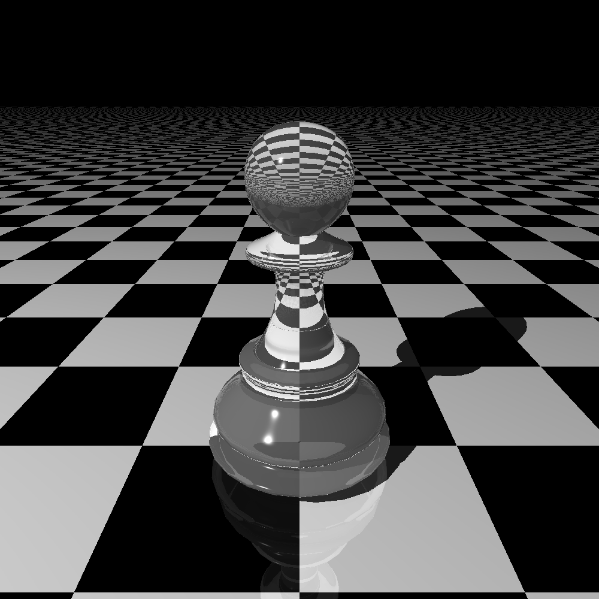
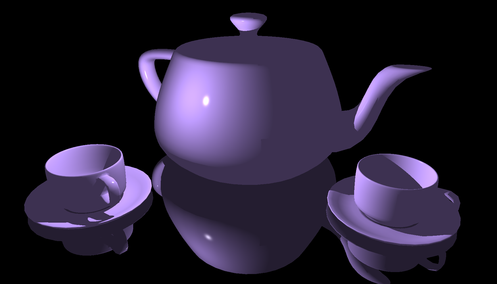
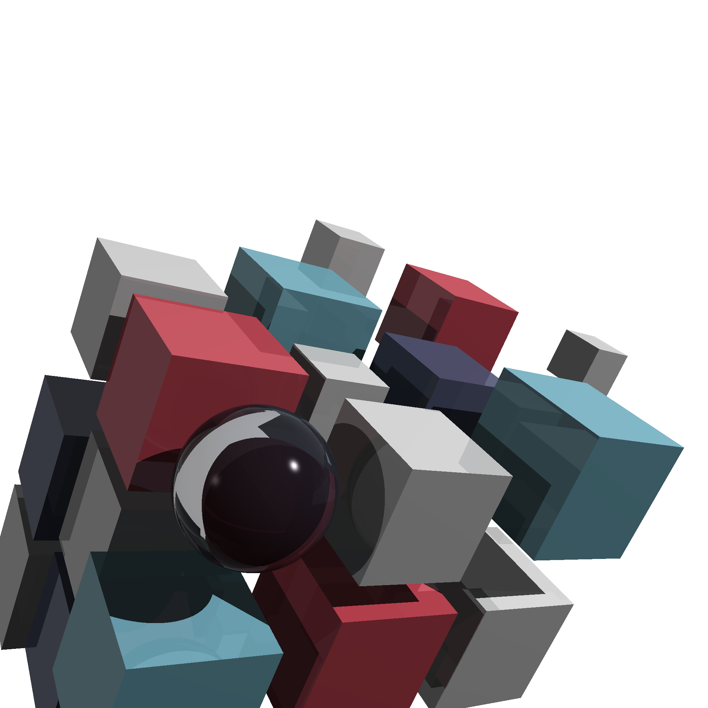

# Ray Tracer

An experimental Ray Tracer built following *The Ray Tracer Challenge*[^1] in Rust with a few of my own additions and optimizations leveraging multi-threading and caching matrix operations.

## Building

```
cargo build --release
```

## Example Renders

There are a handful of example renders which are built into the ray tracer. List them using `--help`. Some renders can take a long time so it's also recommended to specify as many threads as you can spare with `--threads`. 

### Glass Pawn [^2]

| `./target/release/ray_tracer --example="pawn"` |
|:-:|
|   |

### Utah Tea Set [^3][^4]

| `./target/release/ray_tracer --example="tea set"` |
|:-:|
|   |

### Book Cover [^1]

| `./target/release/ray_tracer --example="cover"` |
|:-:|
|   |

## References

[^1]: [The Ray Tracer Challenge](http://raytracerchallenge.com/)
[^2]: [Pawn](https://www.turbosquid.com/3d-models/beautiful-pawn-chess-3d-model-1550111)
[^3]: [Tea Cup](https://www.turbosquid.com/3d-models/cup-saucer-3d-model-1434751)
[^4]: [Utah Tea Pot](https://graphics.cs.utah.edu/courses/cs6620/fall2013/?prj=5)
